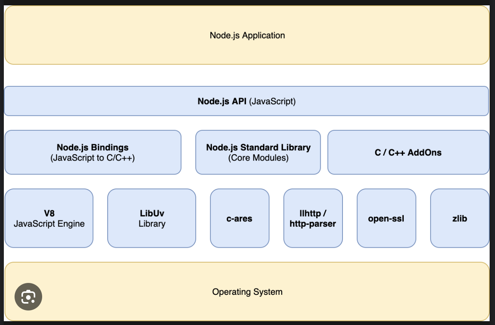

Questions?
- full form of ui/ux
- why it is important to have a good ui/ux
- what do you mean by progressive framework?
- what do mean by pwa?
- what do you mean by Node.js
- feature of node?
- what is architecture? . blueprint 
- components of node?

- what are c-ares?
- where is console present in node?
- internal javascript is object-oriented?
- REPL?
- how to use ES5 only?
- how many types of constructor in JS
- namespaces?
- export import and require?

